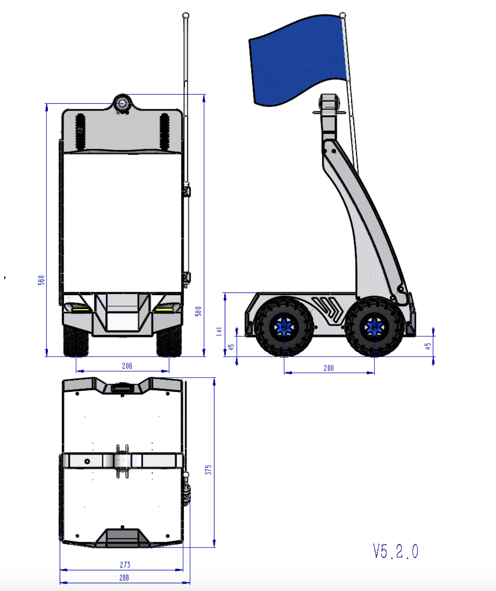
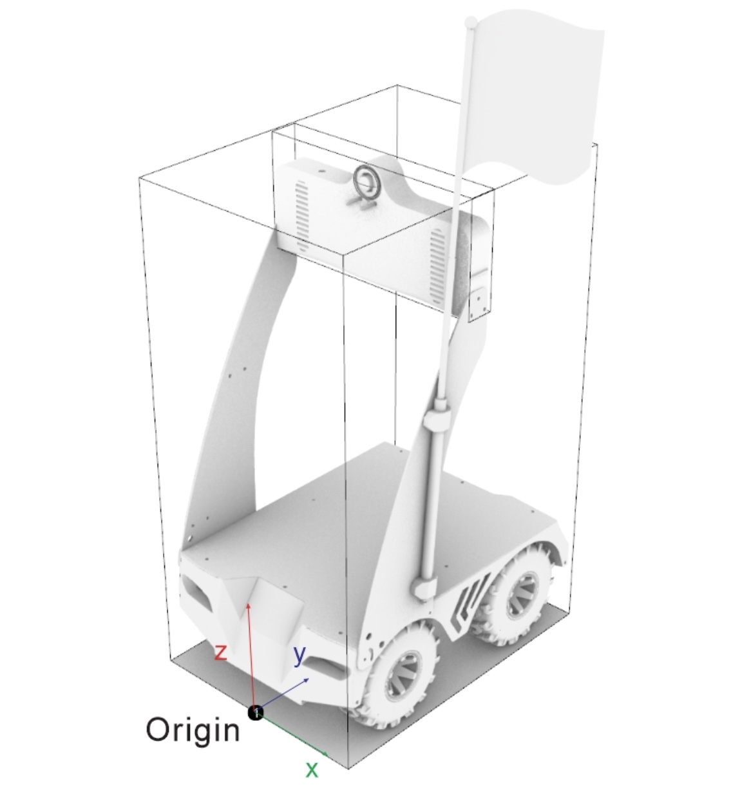

<p align="center">
  
  <h3 align="center">Frodobots AI</h3>
  <br>
</p>

# Earth Rovers SDK v4.4

## Requirements

[Change to Flow v2]

1. Acquire one of our Earth Rovers in here: [Earth Rovers Shop](https://shop.frodobots.com/).


2. Complete your Bot activation.

3. After completing your bot activation. Get your SDK Access token in [here](https://my.frodobots.com/owner/settings).


## Software Requirements
- Python 3.9 or higher
- Frodobots API key
- Google Chrome (Or any browser) installed

## Hardware Specs

<div style="display: flex; flex-direction: row; justify-content: center; align-items: center; gap: 20px;">
  
  
</div>

For full details on the hardware specifications, please refer to the [Frodobots Hardware Specifications](https://docs.google.com/document/d/1Px-rNy0wQeG74mWcReiV4dEk5u4nfMPTVh-C4pXoieY).

More details about the bot sensors and actuators can be found [here](https://colab.research.google.com/#fileId=https%3A//huggingface.co/datasets/frodobots/FrodoBots-2K/blob/main/helpercode.ipynb).

## Getting Started

1. Write once your .env variables provided by Frodobots team your SDK API key and the name of the bot you've got.

```bash
SDK_API_TOKEN=
BOT_SLUG=
CHROME_EXECUTABLE_PATH=
# Default value is MAP_ZOOM_LEVEL=18 https://wiki.openstreetmap.org/wiki/Zoom_levels
MAP_ZOOM_LEVEL=
MISSION_SLUG=
```

2. Install the SDK

```bash
pip3 install -r requirements.txt
```

3. Run the SDK

```bash
hypercorn main:app --reload
```

4. Now you can check the live streaming of the bot in the following URL: http://localhost:8000

## Documentation

This SDK is meant to control the bot and at the same time monitor its status. The SDK has the following open endpoints:

### POST /control

With this endpoint you can send linear and angular values to move the bot. The values are between -1 and 1.

```bash
curl --location 'http://localhost:8000/control' \
--header 'Content-Type: application/json' \
--data '{
    "command": { "linear": 1, "angular": 1 }
}'
```

Example response:

```JSON
{
    "message": "Command sent successfully"
}
```

### GET /data

With this endpoint you can retrieve the latest data from the bot. (e.g. battery level, position, etc.)

```bash
curl --location 'http://localhost:8000/data'
```

Example Response:

```JSON
{
    "battery": 100,
    "signal_level": 5,
    "orientation": 128,
    "lamp": 0,
    "speed": 0,
    "gps_signal": 31.25,
    "latitude": 22.753774642944336,
    "longitude": 114.09095001220703,
    "vibration": 0.31,
    "timestamp": 1724189733.208559,
    "accels": [
        [0.998,0.003,0.005,1725434620.858],
        [1,0.002,0.005,1725434620.964],
        [1,0.002,0.005,1725434620.964],
        [1,0.003,0.004,1725434621.079],
        [0.997,0.003,0.008,1725434621.192],
        [0.998,0.003,0.002,1725434621.294]
    ],
    "gyros": [
        [0.521,0.023,0.716,1725434620.913],
        [0.552,0.023,0.732,1725434621.02],
        [0.483,0.015,0.732,1725434621.122],
        [0.407,-0.007,0.747,1725434621.239],
        [0.453,0.061,0.724,1725434621.343]
    ],
    "mags": [
        [-1002,967,12,1725434621.194]
    ],

    "rpms": [
        [0,0,0,0,1725434567.194],
        [0,0,0,0,1725434567.218],
        [0,0,0,0,1725434597.682],
        [0,0,0,0,1725434597.701],
        [0,0,0,0,1725434597.726]
    ],
}
```

### GET /screenshot

With this endpoint you can retrieve the latest emitted frame and timestamp from the bot. The frame is a base64 encoded image. And the timestamp is the time when the frame was emitted (Unix Epoch UTC timestamp).
Inside the folder screenshots/ you can find the images.

This endpoint accepts a list of view types as a query parameter (view_types). Valid view types are rear, map, and front. If no view types are provided, it will return all three by default.

```bash
curl --location 'http://localhost:8000/screenshot?view_types=rear,map,front'
```

Example Response:

```JSON
{
    "front_frame": "base64_encoded_image",
    "rear_frame": "base64_encoded_image",
    "map_frame": "base64_encoded_image",
    "timestamp": 1724189733.208559
}
```

```bash
curl --location 'http://localhost:8000/screenshot?view_types=rear'
```

Example Response:

```JSON
{
    "rear_video_frame": "base64_encoded_image",
    "timestamp": 1724189733.208559
}
```

## Missions API

In order to start a mission you need to call the /start-mission endpoint. This endpoint will let you know if the bot is available or not for the mission.

To enable the missions API you need to set the MISSION_SLUG environment variable to the slug of the mission you want to start.

```bash
MISSION_SLUG=mission-1
```

If you just want to experiment with the bot without starting a mission you need to remove the MISSION_SLUG environment variable.

`Note: Bots that are controlled by other players are not available for missions.`

### POST /start-mission
```bash
curl --location --request POST 'http://localhost:8000/start-mission'
```

Successful Response (Code: 200)
```JSON
{
    "message": "Mission started successfully"
}
```

Unsuccessful Response (Code: 400)
```JSON
{
    "detail": "Bot unavailable for SDK"
}
```

### POST /checkpoints-list

With this endpoint you can retrieve the list of checkpoints for the mission. And the latest checkpoint that was scanned by the bot. If you scan the first checkpoint, the latest_scanned_checkpoint will be 1. If you scan the last checkpoint, the latest_scanned_checkpoint will be the highest sequence number and the mission will be completed.

```bash
curl --location 'http://localhost:8000/checkpoints-list'
```

Example Response:
```JSON
{
    "checkpoints_list": [
        {
            "id": 4818,
            "sequence": 1,
            "latitude": "30.48243713",
            "longitude": "114.3026428"
        },
        {
            "id": 4819,
            "sequence": 2,
            "latitude": "30.48268318",
            "longitude": "114.3026047"
        },
        {
            "id": 4820,
            "sequence": 3,
            "latitude": "30.48243713",
            "longitude": "114.3026428"
        }
    ],
    "latest_scanned_checkpoint": 0
}
```

### POST /checkpoint-reached

With this endpoint you can send the checkpoint that was scanned by the bot.

```bash
curl -X POST 'http://localhost:8000/checkpoint-reached' \
--header 'Content-Type: application/json' \
--data '{}'
```

Successful Response (Code: 200)
```JSON
{
    "message": "Checkpoint reached successfully",
    "next_checkpoint_sequence": 2
}
```

Unsuccessful Response (Code: 400)
```JSON
{
    "detail": {
        "error": "Bot is not within XX meters from the checkpoint",
        "proximate_distance_to_checkpoint": 16.87
    }
}
```

### POST /end-mission

With this endpoint you can force the mission to end in case you face some errors. Note that once you run this endpoint, the bot will be disconnected and will be available again for other players to use.

In case you get stucked and don't want to lose your progress, you can use the /start-mission endpoint to refresh it.

`⚠️  This endpoint should only be used in case of emergency. If you run this endpoint you will lose all your progress during the mission.`


```bash
curl --location --request POST 'http://localhost:8000/end-mission'
```

Example Response:
```JSON
{
    "message": "Mission ended successfully"
}
```

### GET /missions-history

With this endpoint you can retrieve the missions history of the bot you've been riding.

```bash
curl --location 'http://localhost:8000/missions-history'
```

Example Response:
```JSON
{
    "mission_rides": [
        {
            "id": 86855,
            "mission_slug": "mission-1",
            "success": true,
            "latest_scanned_checkpoint": 3,
            "status": "active",
            "start_time": "2024-09-02T07:38:46.755Z",
            "end_time": "2024-09-02T07:45:46.755Z"
        },
        // ...
    ]
}
```


# Latest updates
- v.4.4: Minor Bugfixes. Spectate Rides.
- v.4.3: Missions history and more information on checkpoint reached. Improved /data RTM messages
- v.4.2: Updated Readme.md
- v.4.1: End mission.
- v.4.0: Added the ability to start a mission. Improved screenshots timings. Timestamps accuracy improved.
- v3.3: Improved control speed.
- v3.2: Added the ability to control the zoom level of the map.
- v3.1: Ability to retrieve rear camera frame and map screenshot. Bug fixes.

## Contributions

- [Michael Cho](mailto:michael.cho@frodobots.com)
- [Santiago Pravisani](mailto:santiago.pravisani@frodobots.com)
- [Esteban Fuhrmann](mailto:esteban.fuhrmann@frodobots.com)

## Join our Discord

- [Frodobots Discord](https://discord.com/invite/AUegJCJwyb)

