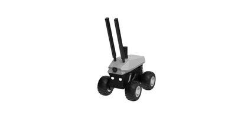
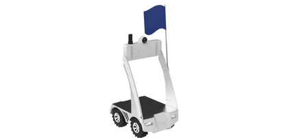
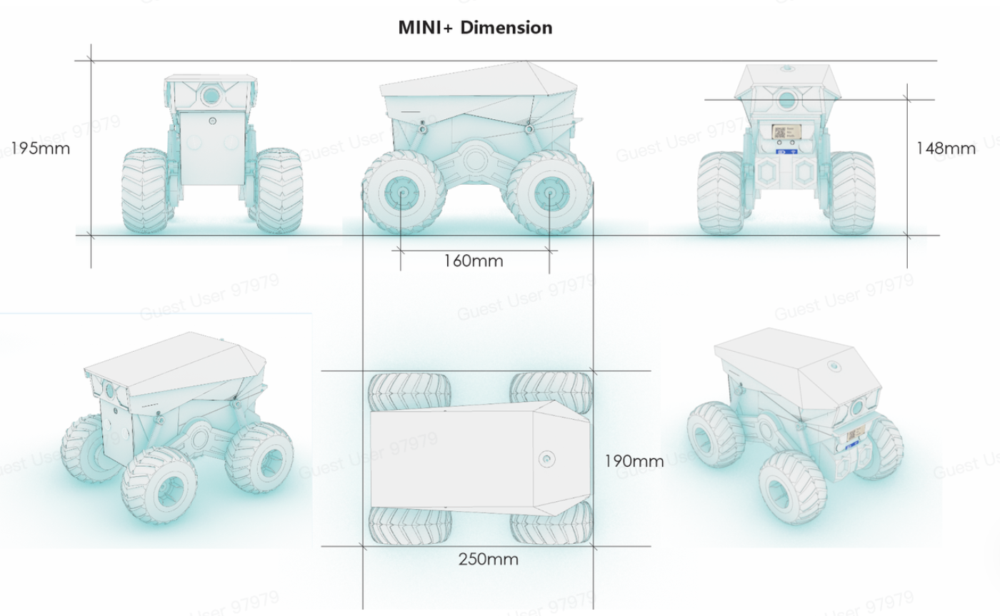
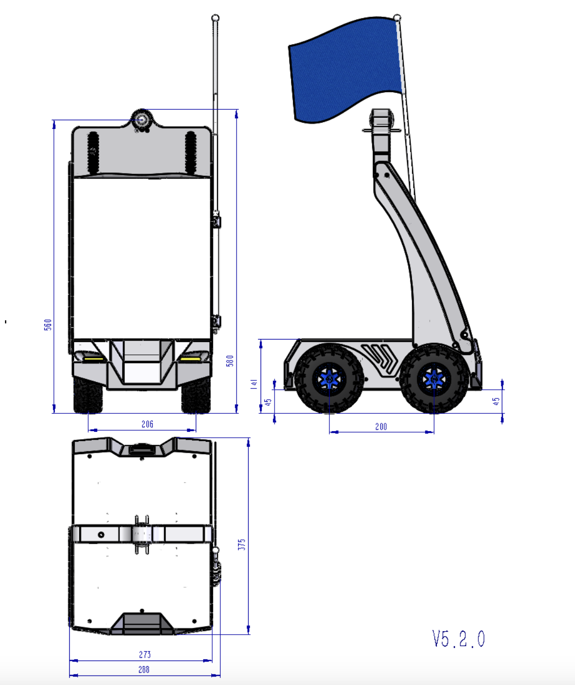
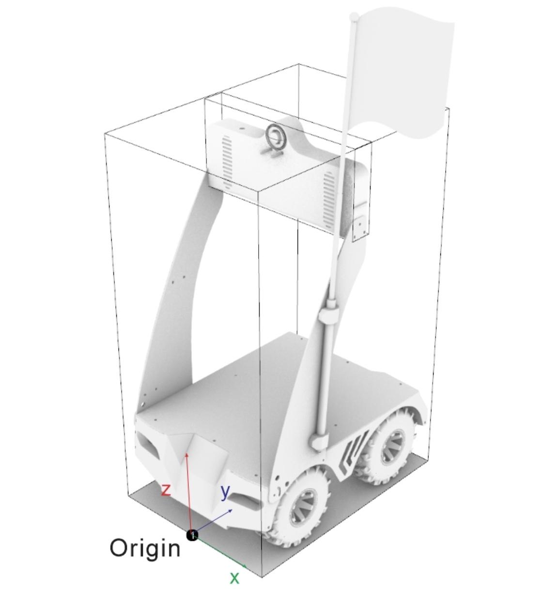

<p align="center">
  
  <h3 align="center">Frodobots AI</h3>
  <br>
</p>

# Earth Rovers SDK v6.3

## Requirements

1. Acquire one of our Earth Rovers in here: [Earth Rovers Shop](https://shop.frodobots.com/).

2. Complete your Bot activation.

3. After completing your bot activation, get your SDK Access token and bot slug from the same page: [my.frodobots.com/owner/settings](https://my.frodobots.com/owner/settings). These become `SDK_API_TOKEN` and `BOT_SLUG` in your `.env` — they must belong to the same account, or every SDK request fails with "Bot not found".

## Software Requirements

- Python 3.9 or higher
- Frodobots API key

The SDK uses [Playwright](https://playwright.dev/python/), which downloads and manages its own Chromium — no separate browser install is required. To use a specific browser binary instead (e.g. real Google Chrome), set `CHROME_EXECUTABLE_PATH` in your `.env`.

## The Earth Rover family

The SDK works with every Earth Rover model. Rear-camera features (`/v2/rear`, `/feed?view=rear`, the dashboard PiP) activate automatically on bots that publish a rear stream.

|  | MINI | MINI+ | ZERO |
|---|---|---|---|
|  |  |  |  |
| Cameras | 1 (front) | 2 (front + rear) | 2 (front + rear) |
| Front camera (web) | 1024×576 | 1024×576 (from 1080p) | 1024×576 |
| Rear camera (web) | — | 480×270 (from 1080p) | ✓ |
| Weight | — | 1.4 kg (car only) | — |
| Size (L×W×H) | — | 250×190×195 mm | 375×288×560 mm |
| Wheelbase | — | 160 mm | 200 mm |
| Ground clearance | — | 45 mm | 45 mm |
| Top speed | — | 4 km/h | — |
| Range | — | 12 km | — |
| Max slope | — | 18° | — |
| Water resistance | — | IP34 | — |
| Payload | — | — | up to 4 kg |
| Notes | Same V6 chassis family as MINI+ | Turns on the spot, 2 motors / 4WD | More stable 4G, accurate GPS positioning |

### MINI+ (V6.2, double camera)



- **Chassis**: 1.4 kg (car only), 95 mm wheels, two motors with four-wheel drive, turns on the spot, IP34, 18° max slope, 12 km range per charge, top speed 4 km/h.
- **Cameras**: front and rear, GC2093 sensor, FOV D148° / H126° / V67°, effective focal length 2.72 mm, distortion < 20%. Web streams are downscaled from 1920×1080 to 1024×576 (front) and 480×270 (rear).
- **IMU**: MPU6050 — telemetry reports every 2 s with 100 accelerometer samples, 1 gyroscope sample and 1 magnetometer sample per report (these arrive in `/data` as `accels`, `gyros`, `mags`).
- Hardware sources, firmware and 3D-print files: [earth-rover-mini repository](https://github.com/frodobots-org/earth-rover-mini) · [Shop](https://shop.frodobots.com/collections/earth-rovers/products/earth-rover-mini-plus)

### ZERO (V5.2)

<div style="display: flex; flex-direction: row; justify-content: center; align-items: center; gap: 20px;">
  
  
</div>

- 375×288 mm footprint, 560 mm tall (580 mm to the top of the camera mast), 200 mm wheelbase, 45 mm ground clearance.
- Front and rear cameras, carries up to 4 kg of payload, more stable 4G connectivity and accurate GPS positioning.

For full details on the hardware specifications, please refer to the [Frodobots Hardware Specifications](https://docs.google.com/document/d/1Px-rNy0wQeG74mWcReiV4dEk5u4nfMPTVh-C4pXoieY).

More details about the bot sensors and actuators can be found [here](https://colab.research.google.com/#fileId=https%3A//huggingface.co/datasets/frodobots/FrodoBots-2K/blob/main/helpercode.ipynb).

## Getting Started

1. Write once your .env variables provided by Frodobots team your SDK API key and the name of the bot you've got.

```bash
# Your personal SDK access token, from https://my.frodobots.com/owner/settings
# (Settings -> SDK Access Token, after completing bot activation).
SDK_API_TOKEN=
# The slug of the bot this token owns, also from that same settings page. Must
# belong to the account SDK_API_TOKEN was issued for, or every request fails
# with "Bot not found" / "Bot unavailable for SDK".
BOT_SLUG=
# Shared secret this server requires on every API call (Authorization: Bearer
# ...). The read-only /feed endpoint and /ws/data also accept ?key= because
# some streaming clients cannot set a header. Not a FrodoBots credential — it
# must be at least 32 characters; generate a random value, e.g.
# `python3 -c "import secrets; print(secrets.token_urlsafe(32))"`.
# Leaving it unset still works — the server generates one at startup and logs
# it — but that value changes every restart, so set one explicitly here for
# anything beyond a quick local test, and definitely before exposing port
# 8000 on a LAN/Docker host — it's the only thing gating a real rover's
# controls at that point.
ROVER_API_KEY=
# Cross-origin browser JS (fetch/XHR from a page on a different origin) is
# denied by default. Leave unset unless you're serving a frontend from
# somewhere other than this server itself — e.g. examples/web/*.html need
# their serving origin listed here (comma-separated), or the browser blocks
# their requests with a valid key. Serve them with a local static server
# (`python3 -m http.server 5500` from examples/web/) rather than opening the
# file directly — browsers send Origin: null for file:// pages, which most
# CORS setups (including ALLOWED_ORIGINS matching) can't allowlist reliably.
# ALLOWED_ORIGINS=http://localhost:5500
# Optional: use a specific browser binary instead of Playwright's Chromium
# CHROME_EXECUTABLE_PATH=
# Default value is MAP_ZOOM_LEVEL=18 https://wiki.openstreetmap.org/wiki/Zoom_levels
MAP_ZOOM_LEVEL=
MISSION_SLUG=
# Image quality between 0.1 and 1.0 (default: 0.8)
# Recommended: 0.8 for better performance
IMAGE_QUALITY=0.8
# Image format: jpeg, png or webp (default: jpeg)
IMAGE_FORMAT=jpeg
# Dedicated MJPEG feed quality (always JPEG; default: 0.8)
FEED_JPEG_QUALITY=0.8
# Seconds the shared capture loop stays warm after the last /feed client or
# /v2 snapshot poll (default: 10)
# FEED_IDLE_LINGER_S=10
# Seconds /v2/* waits for a fresh frame before failing fast (default: 2)
# V2_FRAME_TIMEOUT_S=2
# TTS Provider: "edge" (free, default) or "gemini"
TTS_PROVIDER=edge
# API key (required for gemini only)
TTS_API_KEY=
# Voice name (default: en-US-GuyNeural for edge, Kore for gemini)
TTS_VOICE=en-US-GuyNeural
```

2. Install the SDK

```bash
pip3 install -r requirements.txt
playwright install chromium
```

> **Don't skip `playwright install chromium`** — it downloads the headless browser the SDK drives. Without it, endpoints fail with "Executable doesn't exist". On Windows, run it as `python -m playwright install chromium` from the same environment/venv you installed the requirements in. Re-run it after upgrading the `playwright` package (each version pins its own browser build).

3. Run the SDK

```bash
hypercorn main:app --reload
```

4. Open the dashboard at `http://localhost:8000` and enter the key the server logged on startup (or the one you set). The login exchanges it for an HttpOnly, same-site dashboard cookie, so the control secret does not appear in browser history or access logs. Machine API calls need the key sent as `-H "Authorization: Bearer $ROVER_API_KEY"`.

### Docker network exposure

The image binds to `127.0.0.1` by default. `docker-compose.yml` opts into the container interface internally but publishes port 8000 only on host loopback (`127.0.0.1:8000`). Replace its `ROVER_API_KEY` placeholder before starting it.

To make a rover server reachable from the LAN, both changes must be explicit: set `ROVER_BIND_HOST=0.0.0.0` inside the container and publish `8000:8000` (or a specific trusted host address). Only do this with a strong `ROVER_API_KEY` and appropriate network firewalling.

## Dashboard

`http://localhost:8000` serves a real-time operations dashboard:

- **Live video**: the front camera stream (and rear camera picture-in-picture when the bot publishes one), joined directly as an Agora spectator.
- **Map**: the rover's position with a heading arrow, a breadcrumb trail of its path, and the mission checkpoints.
- **Compass**: the rover's orientation on an analog dial.
- **Telemetry**: battery, speed, signal, GPS, vibration and lamp tiles. Flip the **Real time** switch in the header to stream updates live over a WebSocket; leave it off for a single snapshot.
- **Drive controls**: on-screen d-pad or WASD/arrow keys (10 commands/s while held, an automatic stop command on release or when the tab loses focus), a speed slider, lamp toggle and a STOP button.
- **Speak**: send text through the rover's speaker via `/speak`.

The machine-facing page the SDK drives internally lives at `/sdk` and is intentionally minimal — the `/screenshot` and `/v2/*` endpoints capture from it.

> Note: in previous versions `http://localhost:8000` served the raw spectator stream page. That page is gone; `/sdk` remains for the SDK's internal use.

## Documentation

This SDK is meant to control the bot and at the same time monitor its status. The SDK has the following open endpoints:

### POST /control

With this endpoint you can send linear and angular values to move the bot, and control the lamp. The linear and angular values are between -1 and 1. The lamp value is 0 (off) or 1 (on).

> **Important — the rover executes its last command until a new one arrives.** A single `{"linear": 1}` keeps the bot driving indefinitely. Always stream commands continuously while moving (10 Hz is typical) and send `{"linear": 0, "angular": 0}` to stop.
>
> **Delivery semantics (v6.1)**: a `200` means the command was **dispatched** to the rover's messaging channel — it does not wait for the rover's acknowledgement, so the endpoint stays fast for control loops. Delivery health (messages dispatched/delivered/failed, last error) is visible in `GET /status` under `rtm`.
>
> **Dead-man watchdog (v6.1)**: the watchdog arms when a motion command is accepted (even if delivery is uncertain), then follows Agora's confirmed-delivery timestamp rather than raw incoming requests. If no command is confirmed within `CONTROL_WATCHDOG_S` seconds (default **3**), the SDK sends a stop and keeps retrying — rebuilding the browser/RTM session if needed — until the rover **confirms receipt**. Failed retry traffic therefore cannot suppress the deadline. This protects against controller crashes and command-path drops mid-drive; it cannot help if the **rover itself** loses connectivity (that requires a firmware-side failsafe). Streaming clients should set `CONTROL_WATCHDOG_S=0.5`–`1`; `0` disables it.

```bash
curl --location 'http://localhost:8000/control' \
  -H "Authorization: Bearer $ROVER_API_KEY" \
--header 'Content-Type: application/json' \
--data '{
    "command": { "linear": 1, "angular": 1, "lamp": 0 }
}'
```

**Parameters:**

- `linear`: Movement speed forward/backward (-1 to 1)
- `angular`: Rotation speed left/right (-1 to 1)
- `lamp`: Lamp control (0 = off, 1 = on)

Example response:

```JSON
{
    "message": "Command sent successfully"
}
```

### GET /data

With this endpoint you can retrieve the latest data from the bot. (e.g. battery level, position, etc.)

```bash
curl --location 'http://localhost:8000/data' -H "Authorization: Bearer $ROVER_API_KEY"
```

Example Response:

```JSON
{
    "battery": 100,
    "signal_level": 5,
    "orientation": 128,
    "lamp": 0,
    "speed": 0,
    "gps_signal": 31.25,
    "latitude": 22.753774642944336,
    "longitude": 114.09095001220703,
    "vibration": 0.31,
    "timestamp": 1724189733.208559,
    "accels": [
        [0.998,0.003,0.005,1725434620.858],
        [1,0.002,0.005,1725434620.964],
        [1,0.002,0.005,1725434620.964],
        [1,0.003,0.004,1725434621.079],
        [0.997,0.003,0.008,1725434621.192],
        [0.998,0.003,0.002,1725434621.294]
    ],
    "gyros": [
        [0.521,0.023,0.716,1725434620.913],
        [0.552,0.023,0.732,1725434621.02],
        [0.483,0.015,0.732,1725434621.122],
        [0.407,-0.007,0.747,1725434621.239],
        [0.453,0.061,0.724,1725434621.343]
    ],
    "mags": [
        [-1002,967,12,1725434621.194]
    ],

    "rpms": [
        [0,0,0,0,1725434567.194],
        [0,0,0,0,1725434567.218],
        [0,0,0,0,1725434597.682],
        [0,0,0,0,1725434597.701],
        [0,0,0,0,1725434597.726]
    ],
}
```

### GET /screenshot

This endpoint captures the requested views and returns each image as base64. The timestamp records when the response capture completed (Unix Epoch UTC).

This endpoint accepts a list of view types as a query parameter (view_types). Valid view types are rear, map, and front. If no view types are provided, it will return all three by default.

```bash
curl --location 'http://localhost:8000/screenshot?view_types=rear,map,front' -H "Authorization: Bearer $ROVER_API_KEY"
```

Example Response:

```JSON
{
    "front_frame": "base64_encoded_image",
    "rear_frame": "base64_encoded_image",
    "map_frame": "base64_encoded_image",
    "timestamp": 1724189733.208559
}
```

```bash
curl --location 'http://localhost:8000/screenshot?view_types=rear' -H "Authorization: Bearer $ROVER_API_KEY"
```

Example Response:

```JSON
{
    "rear_frame": "base64_encoded_image",
    "timestamp": 1724189733.208559
}
```

### GET /v2/screenshot

This endpoint returns fresh cached camera frames as base64 with their actual capture timestamps. The rear camera is detected automatically: if the bot publishes a rear stream (e.g. Mini+, Zero), the response includes `rear_frame`; single-camera bots return only the front. The legacy `timestamp` field is the newest capture, while `front_timestamp` and `rear_timestamp` identify each frame precisely.

Polling this endpoint at a steady rate (e.g. 10 Hz from a ROS node) is fully supported: the shared capture loop stays warm between polls (`FEED_IDLE_LINGER_S`, default 10 s), so each request returns a fresh, distinct frame in tens of milliseconds. If a fresh frame can't be produced within `V2_FRAME_TIMEOUT_S` (default 2 s) the endpoint fails fast — 503 with the capture error when known, 404 otherwise — instead of stalling; keep polling and it recovers as soon as the camera does.

You can parametrize the image quality between 0.1 and 1.0, and the format between jpeg, png and webp, using the IMAGE_QUALITY and IMAGE_FORMAT environment variables.

> **Performance trap**: `/v2/*` shares the warm frame cache with `/feed` only in the default configuration (`IMAGE_FORMAT=jpeg` with `IMAGE_QUALITY` equal to `FEED_JPEG_QUALITY`). Setting a different format or quality silently switches `/v2/*` to an uncached per-request capture path, which is significantly slower under polling. If you poll for frames, keep the defaults.

```bash
curl --location 'http://localhost:8000/v2/screenshot' -H "Authorization: Bearer $ROVER_API_KEY"
```

Example Response:

```JSON
{
    "front_frame": "base64_encoded_image",
    "rear_frame": "base64_encoded_image",
    "front_timestamp": 1724189733.198559,
    "rear_timestamp": 1724189733.208559,
    "timestamp": 1724189733.208559
}
```

### GET /v2/front

This endpoint allows you to retrieve the latest frame emitted from the bot's front camera. The frame is provided as a base64 encoded image.

You can parametrize the image quality between 0.1 and 1.0, and the format between jpeg, png and webp, using the IMAGE_QUALITY and IMAGE_FORMAT environment variables.

```bash
curl --location 'http://localhost:8000/v2/front' -H "Authorization: Bearer $ROVER_API_KEY"
```

Example Response:

```JSON
{
    "front_frame": "base64_encoded_image",
    "timestamp": 1724189733.208559
}
```

### GET /v2/rear

This endpoint allows you to retrieve the latest frame emitted from the bot's rear camera. The frame is provided as a base64 encoded image.

You can parametrize the image quality between 0.1 and 1.0, and the format between jpeg, png and webp, using the IMAGE_QUALITY and IMAGE_FORMAT environment variables.

```bash
curl --location 'http://localhost:8000/v2/rear' -H "Authorization: Bearer $ROVER_API_KEY"
```

Example Response:

```JSON
{
    "rear_frame": "base64_encoded_image",
    "timestamp": 1724189733.208559
}
```

### POST /speak

With this endpoint you can send text-to-speech audio through the rover's physical speaker. The text is converted to speech and streamed to the rover via the Agora RTC audio channel.

Supports two TTS providers, configurable via environment variables:
- **edge** (default): Free, no API key required, uses Microsoft Edge neural voices
- **gemini**: Uses Google Gemini API, requires `TTS_API_KEY`

```bash
curl --location 'http://localhost:8000/speak' \
  -H "Authorization: Bearer $ROVER_API_KEY" \
--header 'Content-Type: application/json' \
--data '{
    "text": "Hello, I am your rover"
}'
```

**Environment variables:**

```bash
TTS_PROVIDER="edge"          # "edge" or "gemini"
TTS_API_KEY=""                # Required for gemini only
TTS_VOICE="en-US-GuyNeural"  # Voice name (edge voices or gemini voices like "Kore")
```

Example Response:

```JSON
{
    "message": "Speech sent to rover"
}
```

### GET /feed

Live MJPEG stream of a camera (`multipart/x-mixed-replace`) — the recommended way to consume video programmatically (ROS2, OpenCV, recording). Unlike polling `/v2/screenshot`, frames are pushed as they're captured, there's no per-frame HTTP response overhead, and feed and v2 consumers share a latest-frame capture cache.

Query params:

- `view`: `front` (default) or `rear` (bots with a rear camera; 404 otherwise)
- `fps`: 1–30 (default 15)

Needs the API key. Clients that can't set a custom header (a browser tab, `cv2.VideoCapture`) pass it as `?key=` instead. Query authentication is accepted only on this read-only `/feed` endpoint; state-changing endpoints always require a header.

```bash
# Watch it in a browser:
open 'http://localhost:8000/feed?view=front&fps=15&key=YOUR_ROVER_API_KEY'
```

```python
# Or consume it from OpenCV / ROS2:
import cv2
cap = cv2.VideoCapture("http://localhost:8000/feed?view=front&fps=15&key=YOUR_ROVER_API_KEY")
ok, frame = cap.read()
```

Frames are always JPEG regardless of `IMAGE_FORMAT`; tune them with `FEED_JPEG_QUALITY`. A camera that is not ready returns HTTP 503 rather than holding an empty stream open. See `examples/ros2/` for a complete ROS2 bridge node (`cmd_vel`, camera, GPS, IMU, battery).

> **Concurrency**: the SDK server is fully async — `/feed`, `/control`, `/data` and `/v2/*` can all be used simultaneously. Driving the rover while streaming video and reading telemetry is the intended usage pattern.

Run one Hypercorn worker per SDK instance. Browser sessions, camera-frame caches and telemetry fan-out are intentionally kept in process so hot-path requests do not cross a process boundary.

### GET /status

Lightweight health endpoint for the SDK pipeline — no side effects, safe to poll.

Sample Request:

```bash
curl --location 'http://localhost:8000/status' -H "Authorization: Bearer $ROVER_API_KEY"
```

Sample Response:

```json
{
  "browser_ready": true,
  "mission_started": true,
  "ingest_connected": true,
  "telemetry_age_s": 0.42,
  "video": {
    "front": {
      "loop_running": true,
      "latest_frame_age_s": 0.03,
      "captures_total": 18240,
      "failures_total": 2,
      "last_error": null
    },
    "rear": {
      "loop_running": false,
      "latest_frame_age_s": null,
      "captures_total": 0,
      "failures_total": 0,
      "last_error": null
    }
  }
}
```

- `browser_ready`: the headless browser is connected to the rover's channel
- `ingest_connected`: telemetry is flowing from the rover into the SDK
- `telemetry_age_s`: seconds since the last telemetry message (`null` if none yet)
- `video.<camera>`: frame-capture pipeline health per camera — whether the shared capture loop is currently running, the age of the newest cached frame, capture/failure counters since startup, and the most recent capture error (`null` when healthy). Useful for correlating client-side frame latency spikes with server-side capture failures.

### WS /ws/data

WebSocket stream of telemetry for real-time consumers (the dashboard uses it). Browser `WebSocket` clients can't set custom headers, so pass the API key as a query parameter: `ws://localhost:8000/ws/data?key=YOUR_ROVER_API_KEY`. Query credentials are limited to this WebSocket and the read-only `/feed` endpoint. On connect you receive a `snapshot` message with the latest telemetry (or `data: null` if none yet), then a `telemetry` message per rover update and a `status` heartbeat every 5 seconds:

```json
{ "type": "snapshot", "data": { ... }, "ingest_connected": true, "telemetry_age_s": 0.1 }
{ "type": "telemetry", "data": { "battery": 87, "latitude": ..., ... } }
{ "type": "status", "ingest_connected": true, "telemetry_age_s": 1.2 }
```

(`WS /ws/ingest` is the internal, localhost-only channel the `/sdk` page uses to push telemetry into the server — not for external use.)

## Missions API

In order to start a mission you need to call the /start-mission endpoint. This endpoint will let you know if the bot is available or not for the mission.

To enable the missions API you need to set the MISSION_SLUG environment variable to the slug of the mission you want to start.

```bash
MISSION_SLUG=mission-1
```

If you just want to experiment with the bot without starting a mission you need to remove the MISSION_SLUG environment variable.

`Note: Bots that are controlled by other players are not available for missions.`

### GET /missions

Lists the available missions for the bot you are connected to (the one set in `BOT_SLUG`). You don't need to start a mission to call this endpoint. Use the returned `slug` as the `MISSION_SLUG` environment variable to start a mission.

`Note: Missions are only listed for remote bots (the deployed Earth Rovers you drive remotely). Personal bots do not have missions, so this endpoint will return an empty list for them.`

```bash
curl --location 'http://localhost:8000/missions' -H "Authorization: Bearer $ROVER_API_KEY"
```

Example Response:

```JSON
{
    "missions": [
        {
            "slug": "mission-1",
            "distance_in_m": 120.5,
            "checkpoints_count": 3
        }
    ]
}
```

### POST /start-mission

```bash
curl --location --request POST 'http://localhost:8000/start-mission' -H "Authorization: Bearer $ROVER_API_KEY"
```

Successful Response (Code: 200)

```JSON
{
    "message": "Mission started successfully"
}
```

Unsuccessful Response (Code: 400)

```JSON
{
    "detail": "Bot unavailable for SDK"
}
```

### POST /checkpoints-list

### GET /checkpoints-list

With this endpoint you can retrieve the list of checkpoints for the mission. And the latest checkpoint that was scanned by the bot. If you scan the first checkpoint, the latest_scanned_checkpoint will be 1. If you scan the last checkpoint, the latest_scanned_checkpoint will be the highest sequence number and the mission will be completed.

```bash
curl --location 'http://localhost:8000/checkpoints-list' -H "Authorization: Bearer $ROVER_API_KEY"
```

Example Response:

```JSON
{
    "checkpoints_list": [
        {
            "id": 4818,
            "sequence": 1,
            "latitude": "30.48243713",
            "longitude": "114.3026428"
        },
        {
            "id": 4819,
            "sequence": 2,
            "latitude": "30.48268318",
            "longitude": "114.3026047"
        },
        {
            "id": 4820,
            "sequence": 3,
            "latitude": "30.48243713",
            "longitude": "114.3026428"
        }
    ],
    "latest_scanned_checkpoint": 0
}
```

### POST /checkpoint-reached

With this endpoint you can send the checkpoint that was scanned by the bot.

```bash
curl -X POST 'http://localhost:8000/checkpoint-reached' \
  -H "Authorization: Bearer $ROVER_API_KEY" \
--header 'Content-Type: application/json' \
--data '{}'
```

Successful Response (Code: 200)

```JSON
{
    "message": "Checkpoint reached successfully",
    "next_checkpoint_sequence": 2,
    "mission_completed": false
}
```

When the last checkpoint is scanned, the SDK first requires the rover to confirm a zero-motion command. Only then is the checkpoint reported and the ride allowed to end. If the stop cannot be confirmed within `SAFETY_STOP_CONFIRM_TIMEOUT_S` (default 12 seconds), the endpoint returns 503 without reporting the final checkpoint, while stop recovery continues. On success, `mission_completed` is `true`, the SDK clears its session automatically, and `POST /start-mission` begins a new ride.

Unsuccessful Response (Code: 400)

```JSON
{
    "detail": {
        "error": "Bot is not within XX meters from the checkpoint",
        "proximate_distance_to_checkpoint": 16.87
    }
}
```

### POST /end-mission

With this endpoint you can force the mission to end in case you face some errors. Note that once you run this endpoint, the bot will be disconnected and will be available again for other players to use.

In case you get stucked and don't want to lose your progress, you can use the /start-mission endpoint to refresh it.

`⚠️  This endpoint should only be used in case of emergency. If you run this endpoint you will lose all your progress during the mission.`

```bash
curl --location --request POST 'http://localhost:8000/end-mission' -H "Authorization: Bearer $ROVER_API_KEY"
```

Example Response:

```JSON
{
    "message": "Mission ended successfully"
}
```

### GET /missions-history

With this endpoint you can retrieve the missions history of the bot you've been riding.

```bash
curl --location 'http://localhost:8000/missions-history' -H "Authorization: Bearer $ROVER_API_KEY"
```

Example Response:

```JSON
{
    "mission_rides": [
        {
            "id": 86855,
            "mission_slug": "mission-1",
            "success": true,
            "latest_scanned_checkpoint": 3,
            "status": "active",
            "start_time": "2024-09-02T07:38:46.755Z",
            "end_time": "2024-09-02T07:45:46.755Z"
        },
        // ...
    ]
}
```

## Interventions API

The Interventions API allows you to manage interventions during bot rides. An intervention represents a period where the bot requires special attention or handling.

### POST /interventions/start

Start a new intervention for the current bot ride. The bot's current position (latitude and longitude) will be automatically recorded.

```bash
curl -X POST 'http://localhost:8000/interventions/start' -H "Authorization: Bearer $ROVER_API_KEY"
```

Successful Response (Code: 200)

```JSON
{
    "message": "Intervention started successfully",
    "intervention_id": "123e4567-e89b-12d3-a456-426614174000"
}
```

### POST /interventions/end

End an active intervention for the current bot ride. The bot's current position (latitude and longitude) will be automatically recorded.

```bash
curl -X POST 'http://localhost:8000/interventions/end' -H "Authorization: Bearer $ROVER_API_KEY"
```

Successful Response (Code: 200)

```JSON
{
    "message": "Intervention ended successfully"
}
```

Unsuccessful Response (Code: 400)

```JSON
{
    "detail": "No active intervention found"
}
```

### GET /interventions/history

Retrieve the history of interventions for the current bot.

```bash
curl --location 'http://localhost:8000/interventions/history' -H "Authorization: Bearer $ROVER_API_KEY"
```

Example Response:

```JSON
{
    "interventions": [
        {
            "ride_id": "123",
            "start_time": "2024-01-01T12:00:00Z",
            "end_time": "2024-01-01T12:30:00Z",
            "mission_name": "Mission 1",
            "mission_slug": "mission-1",
            "bot_name": "Bot 1",
            "bot_slug": "bot-1"
        }
    ]
}
```

# Latest updates

- v.6.3:

  - Backend errors are no longer swallowed while debugging. With `DEBUG=true`, any non-2xx response from the FrodoBots API is logged with its real status and body, and the actual reason (e.g. `Bot is currently in use by another user`) is returned to the caller in the response `detail` instead of the generic `Bot unavailable for SDK`
  - In normal operation (`DEBUG` unset) the generic message is kept, so backend internals are never exposed to arbitrary callers

- v.6.2:

  - **Reliable `/v2` polling for ROS 2**: the shared camera capture stays warm between snapshot requests, so steady 10 Hz pollers no longer restart capture on every tick
  - Capture failures return an immediate, actionable `503` while recovery backoff continues in the background; snapshot callers never wait inside that backoff
  - `/v2` capture is bounded by `V2_FRAME_TIMEOUT_S` for every configured image format, and `/status` exposes per-camera capture health and failure counters
  - Added plain-Python and ROS 2 Humble polling benchmarks with complete latency accounting (including failed requests), duplicate-frame detection, and missed-tick dropping

- v.6.1:

  - **Safety: dead-man control watchdog.** The rover keeps executing its last command until a new one arrives, so a broken command path after a motion command meant a runaway bot. The watchdog arms when motion is accepted and, once confirmed deliveries go stale for `CONTROL_WATCHDOG_S` (default 3s, `0` disables), delivers a stop and retries — rebuilding the RTM session if needed — until the rover confirms receipt. Failed incoming traffic cannot refresh the deadline.
  - **Fixed RTM disconnect tracking**: the SDK listened for `ConnectionStateChange` but Agora emits `ConnectionStateChanged` — session drops were invisible
  - **Non-blocking control dispatch**: `/control` returns as soon as the command is on the wire instead of blocking up to 4s on the rover's acknowledgement; delivery stats (including Agora's `hasPeerReceived`, previously discarded) are exposed in `GET /status` under `rtm`
  - `/end-mission` and final-checkpoint completion require a confirmed stop before destroying the rover's command session
  - Documented the command-persistence behavior and the recommended continuous-streaming pattern for `/control`

- v.6.0:

  - New real-time dashboard at `http://localhost:8000`: live video, map with heading arrow and breadcrumb trail, compass, telemetry tiles with a "Real time" WebSocket toggle, on-screen/keyboard drive controls and a speak box
  - New `GET /feed` MJPEG streaming endpoint for programmatic video consumption (ROS2/OpenCV-ready), with a shared capture loop across clients
  - New ROS2 bridge example under `examples/ros2/` (`cmd_vel` → control, camera → `sensor_msgs/Image`, GPS/IMU/battery topics)
  - Replaced pyppeteer with Playwright; the browser now warms up eagerly at server start, so the first request is no longer slow
  - Fixed duplicate-browser launches on concurrent first requests and browser-process leaks on failed initialization; the browser now reconnects automatically if it crashes
  - Telemetry is pushed from the rover page into the server and cached, making `/data` faster and powering the new `WS /ws/data` stream and `GET /status` endpoint
  - `playwright install chromium` replaces the Google Chrome requirement (`CHROME_EXECUTABLE_PATH` still works as an override)
  - Removed ~1 MB of unused vendored code
  - Breaking: the old spectator stream page at `/` was replaced by the dashboard (`/sdk` remains)
  - Rear camera availability is now detected at runtime from the bot's published streams (works for any bot with a rear camera — Mini+, Zero); no `BOT_TYPE` configuration needed

- v.5.2:

  - Added `/missions` endpoint to list the available missions for the connected bot
  - No active mission is required; the returned `slug` can be used as `MISSION_SLUG` to start a mission
  - Missions are only listed for remote bots (personal bots return an empty list)

- v.5.1:

  - Added Text-to-Speech (TTS) endpoint `/speak` to play audio through the rover's speaker
  - Supports two TTS providers: Edge TTS (free, default) and Google Gemini
  - Audio streamed to rover via Agora RTC custom audio track
  - Added Openclaw agent configuration files for Telegram-based rover control

- v.5.0:

  - Updated video streaming SDK for Chrome 143+ compatibility
  - Updated real-time messaging SDK to latest stable version
  - Fixed video subscription errors during stream initialization
  - Added subscription queue to prevent race conditions
  - Improved error handling for video stream subscriptions

- v.4.9:

  - Added Interventions API with endpoints for starting, ending and retrieving intervention history
  - New endpoints: /interventions/start, /interventions/end, /interventions/history
  - Added timestamp to /v2/front and /v2/rear endpoints

- v.4.8:
  - Added compatibility for mini and zero bots
  - Added HTML examples for bot control and video streaming (20 FPS)

- v.4.7:
  - Optimized frame capture system to reduce CPU and memory usage
  - Removed continuous frame capture loop, now frames are captured on-demand
  - Improved resource management for video streaming
  - Better handling of system resources during long-running sessions
- v.4.6: Added image quality and format configuration options for better performance
- v.4.5: Minor Bugfixes.
- v.4.4: Minor Bugfixes. Spectate Rides.
- v.4.3: Missions history and more information on checkpoint reached. Improved /data RTM messages
- v.4.2: Updated Readme.md
- v.4.1: End mission.
- v.4.0: Added the ability to start a mission. Improved screenshots timings. Timestamps accuracy improved.
- v3.3: Improved control speed.
- v3.2: Added the ability to control the zoom level of the map.
- v3.1: Ability to retrieve rear camera frame and map screenshot. Bug fixes.

## Troubleshooting

**"camera frame is not available" / `IndexSizeError: getImageData ... source width is 0` / black or empty frames**

The video track is subscribed but no frames are decoding — almost always a **missing H.264 codec**. Some bots publish H.264, which Playwright's open-source Chromium cannot decode. The SDK prefers an installed Google Chrome automatically (it ships all codecs); if Chrome isn't available it falls back to the bundled Chromium and this problem can appear.

Fixes, in order of preference:

1. Install Google Chrome — the SDK picks it up automatically on next start.
2. On platforms without Chrome builds (e.g. Jetson / arm64 Linux): `sudo apt install chromium-browser`, then set `CHROME_EXECUTABLE_PATH=/usr/bin/chromium-browser` in `.env` (distro Chromium builds include H.264).
3. Docker: the image uses the bundled Chromium; if your bot streams H.264, install `chromium` in the image and set `CHROME_EXECUTABLE_PATH=/usr/bin/chromium`.

**"Executable doesn't exist at ..." on startup** — run `python -m playwright install chromium` in the same Python environment, and re-run it after upgrading the `playwright` package.

**Video gets laggy/frozen after a few seconds** — usually network-related between you and the bot (distant regions, weak bot signal), not the SDK; check `signal_level` in `/data` and try a lower `fps` on `/feed`.

## Contributions

- [Michael Cho](mailto:michael.cho@frodobots.com)
- [Santiago Pravisani](mailto:santiago.pravisani@frodobots.com)
- [Esteban Fuhrmann](mailto:esteban.fuhrmann@frodobots.com)

## Join our Discord

- [Frodobots Discord](https://discord.com/invite/AUegJCJwyb)
